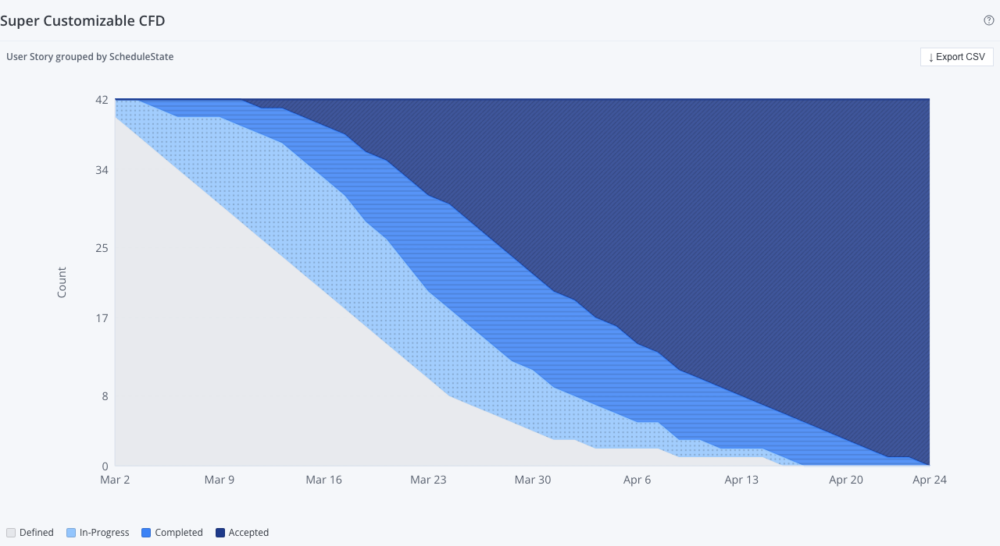

# Super Customizable CFD

A Rally Custom View widget that renders a **Cumulative Flow Diagram (CFD)** for any artifact type with extensive configuration options — artifact type, group-by field, measure, date range, and optional query filter.



---

## What is a CFD?

A Cumulative Flow Diagram shows how work items accumulate in each state over time. The horizontal axis is time; the vertical axis is a count or measure. Each stacked band represents one state value. A healthy CFD shows bands of roughly constant width moving upward together. Bands widening indicate bottlenecks.

---

## Features

- **Any artifact type** — User Stories, Defects, Tasks, Features, Epics, Test Cases
- **Any constrained field** as the group-by axis — ScheduleState, State, Priority, Severity, BOOLEAN fields
- **Flexible measure** — Count (default), Plan Estimate, Task Estimate Total, or any numeric field
- **Date range** — specific start date, specific end date, or "today" for the end date
- **Optional WSAPI query filter** — narrow the chart to items matching a query string
- **CSV export** — download the chart data as a spreadsheet
- **Hover tooltip** — per-series values for any date
- **Colorblind-safe** — each band uses color + pattern overlay so the chart is readable without color vision

---

## Setup

For full end-to-end setup (Rally API key, auth config, dev harness, deployment) see **[docs/setup-guide.md](docs/setup-guide.md)**.

Quick start once auth is configured:

```bash
npm install
npm run dev         # Dev server (mock data) at http://localhost:5175
npm run build       # Production IIFE bundle (live Rally data)
npm run build:mock  # Mock bundle (no Rally credentials needed)
npm run typecheck   # TypeScript check
npx widget-ai deploy  # Build + deploy to Rally as a Custom View
```

---

## Settings

| Setting | Default | Description |
|---|---|---|
| Artifact Type | User Story | HierarchicalRequirement, Defect, Task, Feature, Epic, Test Case |
| Group By Field | ScheduleState | Any constrained STRING, STATE, or BOOLEAN field on the artifact |
| Measure | Count | Count, Plan Estimate, Task Estimate Total, Task Remaining Total, Task Actual Total |
| Start Date | (required) | ISO date string for the first day of the range |
| End Date | today | "today" or a specific ISO date string |
| Additional Filter | (none) | WSAPI query to limit included artifacts, e.g. `(Project.Name = "My Team")` |

---

## Mock Data Scenario

The mock data simulates an 8-week sprint (2026-03-02 to 2026-04-24) for 42 User Stories progressing through ScheduleState (Defined → In-Progress → Completed → Accepted). The scenario shows a healthy delivery cadence with ~70% Accepted by sprint close and no significant bottleneck at any state.

---

## Source Files

| File | Purpose |
|---|---|
| `src/App.tsx` | Main widget — ViewMode chart + EditMode settings |
| `src/types.ts` | `CfdData`, `CfdSettings`, `CfdDataProvider` interfaces |
| `src/cfd-calculator.ts` | Pure CFD computation from Lookback snapshots (no React) |
| `src/data-provider.ts` | Live Rally provider (Lookback API + WSAPI for OID filtering) |
| `src/mock-data.ts` | Mock 8-week sprint scenario + mockContext |
| `src/main.tsx` | Entry point, mock/live branching |
| `src/hooks/useCfdData.ts` | Two-phase fetch hook (WSAPI filter → Lookback CFD) |
| `src/components/CFDChart.tsx` | SVG stacked-area chart with hover tooltip |
| `src/components/Legend.tsx` | Horizontal series legend |

---

## Legacy Reference

This widget is a port of the **Super Customizable CFD** Rally App Catalog app (ExtJS / SDK 2.x).

- **Legacy source:** `code-viewer/dist/apps-html/super-customizable-cfd-App-20260412-213615.html`
- **Key behaviors preserved:**
  - Two-phase fetch: WSAPI filter for OIDs → Lookback API for snapshots
  - Leaf stories only for HierarchicalRequirement (`Children = null` filter)
  - "Count" treated specially (groupByCount vs groupBySum in legacy)
  - Allowed values fetched from field metadata, not hardcoded
  - Start/end date settings with "today" shorthand for end date
  - Optional WSAPI query string filter

- **What changed vs legacy:**
  - Highcharts replaced with a pure SVG implementation (no license requirement)
  - Inline filter control replaced with a simple WSAPI query textarea
  - Rally ExtJS `rallyinlinefiltercontrol` patterns not reproduced (out of scope for Custom Views)
